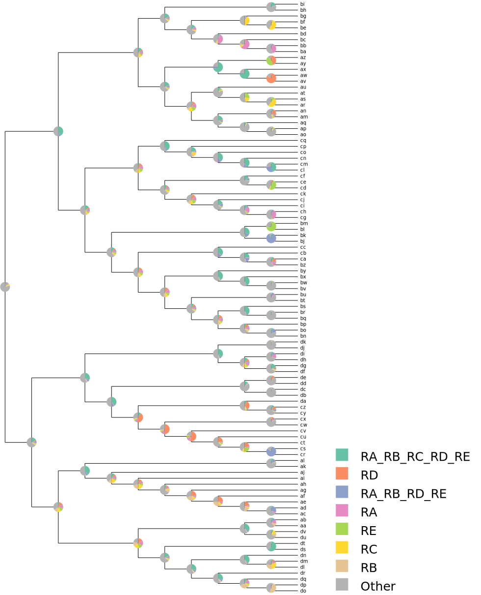

# Introduction

This is a plotting tool for [Lagrange-NG](https://github.com/computations/lagrange-ng), which is a tool for inferring
ancestral biogeographies. Please refer to that repostiory for more information. This tool takes the results JSON file
and plots the results as an SVG. The results are plotted as a phylogram with pie charts at the interior nodes displaying
the likelihood weight ratio for the top distributions. 

# Buliding

To build this tool, simply run

```
cmake -Bbuild -H.
cd build
make
```

and a binary will be placed in the `lagrange-ng-plotter/bin` dir. This tool uses
[Genesis](https://github.com/lczech/genesis) to generate the SVG.

# Usage

An example usage of this tool is

```
./lagrange-ng-plotter --results <RESULTS FROM LAGRANGE-NG> --output output.svg
```

This will read the results file and plot the results in an SVG file called `output.svg`. The resulting plot will look
something like the following



Please note that the distributions which are plotted (i.e. separate from the "other category") are the ones with the
most weight in total on the tree.
